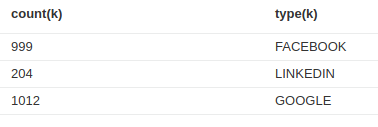

# Offline analysis

This analysis could be done with python, cypher queries and matplotlib for output. Typical output woulb be :

* Pie charts : number of relationships in a network, ...
* Histograms : number of relationships per persons, ...

Next would be to transform thee query result into a json description compatible with D3.js.

For an online presentation of the results, see : <https://github.com/Nilct/Neo4jPythonVega> (work in progress)

## Remarks

The relationship has been simplified. It is now :

`(Person) - [:NETWORK {relation:'typeOfRelation'}] - (Person)

where NETWORK is one of {FACEBOOK, LINKEDIN, GOOGLE}

There is a lot of duplicates :

* `anastasia` is linked 3 times via facebook to `remy`

This could lead to a false detection of an influent member of the community.
The input data should be cleaned before the database injection.

## Simple queries 

### Number of relationships / network

`MATCH (n)-[k]->(m) RETURN count(k), type(k)`

### Number of persons in each network

`MATCH (n)-[k]->(m) RETURN count(DISTINCT n), type(k)`

### Persons belonging to several networks (1, 2 or 3)

`MATCH (n)-[k]->(m) WHERE COUNT(DISTINCT k)=3 RETURN COUNT(n)`

> not working

### Distribution of the number of relationships / persons

`MATCH (n) RETURN n, SIZE((n)-[:FACEBOOK]->()),SIZE((n)-[:GOOGLE]->()),SIZE((n)-[:LINKEDIN]->())`

`MATCH (n) RETURN n, SIZE((n)-[:FACEBOOK]-()),SIZE((n)-[:GOOGLE]->()),SIZE((n)-[:LINKEDIN]->()) ORDER BY SIZE((n)-[:FACEBOOK]->()) DESC`

### Distribution of relationships (anytype)

`MATCH (n) RETURN n, SIZE((n)-[:FACEBOOK|:GOOGLE]-()) ORDER BY SIZE((n)-[:FACEBOOK|:GOOGLE|:LINKEDIN]-()) DESC`

Simpler version :`MATCH (n:Person)-[k]-(m)  RETURN n, count(k) ORDER BY count(k) DESC`

> **BEWARE** Results are different !!!! To be continued
