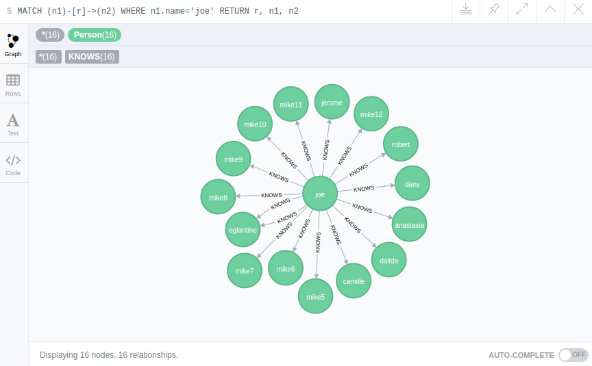
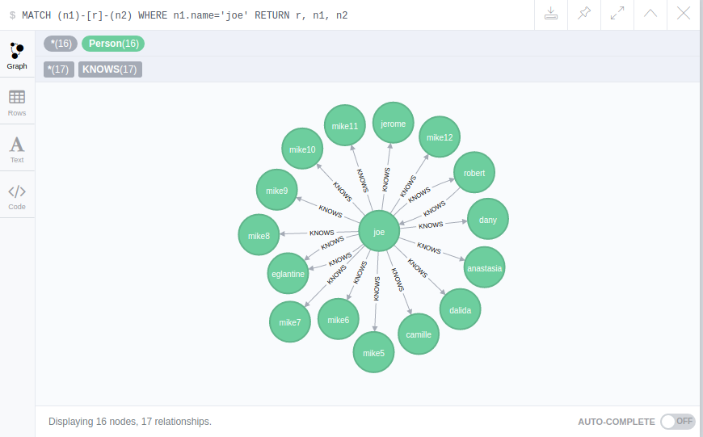
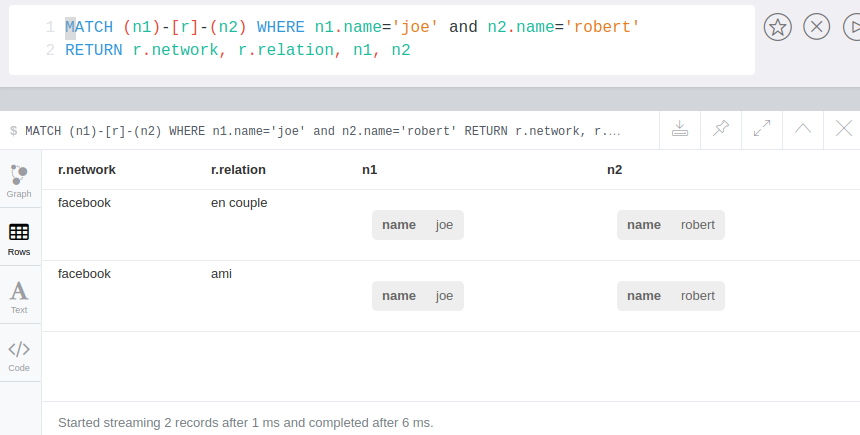

# Database setup

Tools :

* **java8** (not 9!)
* **neo4j** community edition
* **python 3.4** (default on RPI)
* python libraries : **pandas**, **py2neo** (available through **pip3**)

## Step by step

1. Launch neo4j server : `/home/nil/Utils/neo4j-community-3.1.1/bin/neo4j start`

> replace with your own path

2. Check server on web client : <http://localhost:7474/browser/>

> change password to *social* (this is used in the python script)

3. Run python script `python3 importdata.py ../data/`
4. Test with query : `MATCH ( person {name: 'roger'})-[:KNOWS]->(someone) RETURN person.name, someone.name` on webpage

> ATTENTION : drop database before **re**launching the python script (directly in the database folder, with `rm -rf data/database/graph.db`)

## Data import

All 3 social network files are imported. Then all persons are imported as **nodes**, eg.:
``` sql
 CREATE (name: Roger {name: 'Roger'})
```

The graph will contains these kind of relationships :
``` sql
MATCH (n:Person),(m:Person) 
WHERE n.name='roger' and m.name='bertrand' 
CREATE (n)-[:KNOWS {network: 'linkedin', relation: 'en relation'}] ->(m)
```

## Tests

### No graphs

``` sql
MATCH ( person {name: 'roger'})-[:KNOWS]->(someone) 
RETURN person.name, someone.name
```
> everyone that *roger* knows


``` sql
match (n)-[k:KNOWS]-(m) WHERE  k.network='google+' and k.relation='famille' RETURN n.name, k.network, k.relation, m.name
```
> all relationships labeled with *google+* and *famille*

### With graph

``` sql
MATCH (n1)-[r]->(n2) WHERE n1.name='joe' 
RETURN r, n1, n2
```
> all relationships from *joe*

The graph :



``` sql
MATCH (n1)-[r]-(n2) WHERE n1.name='joe' 
RETURN r, n1, n2
```
> all relationships with *joe* either as n1 or n2 (bidirectionnal query)

The graph :


There is one redundancy *joe* and *robert* :
